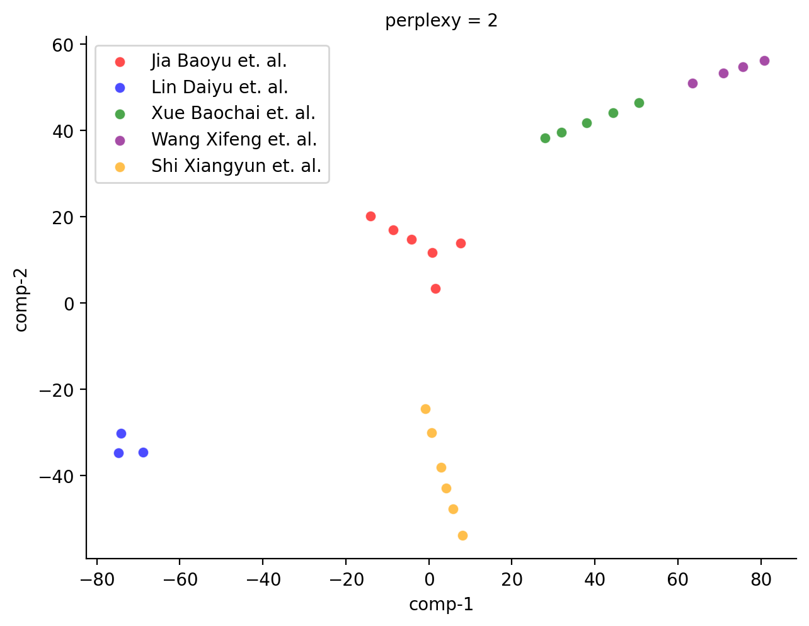

# 3-LCPM Directory README

The 3-LCPM directory contains scripts for generating a Literary Character Personality Map (LCPM) and selecting characters based on personality traits. This is the third component of our model.

## Directory Contents

The 3-LCPM directory contains several Python files that serve different purposes:

- `generate_lcpm.py`: This script generates the Literary Character Personality Map (LCPM) using reviews and Chinese traits found in `data/processed/books/reviews.json` and `data/processed/Component1-Lexicon/chineseTraits.json` respectively. The map is built based on word frequency. Here's a small example of the output, formatted using markdown:

|    | Name       | 善良 | 尊重女性 | 多情 | 温柔 | 敏感 | 细腻 | 孤独 | 叛逆 | 懒散 | 复杂 |
|----|------------|------|----------|------|------|------|------|------|------|------|------|
| 1  | Jia Baoyu  | 5    | 5        | 4    | 4    | 3    | 3    | 2    | 2    | 1    | 1    |
| 2  | Lin Daiyu  | 0    | 0        | 0    | 0    | 3    | 0    | 0    | 0    | 0    | 0    |
| 3  | Xue Baochai | 0    | 0        | 0    | 0    | 0    | 0    | 0    | 0    | 0    | 0    |
| 4  | Wang Xifeng | 0    | 0        | 0    | 0    | 0    | 0    | 0    | 0    | 0    | 0    |
| 5  | Shi Xiangyun| 2    | 0        | 0    | 0    | 0    | 0    | 0    | 0    | 0    | 0    |
| 6  | Jia Yuanchun| 0    | 0        | 0    | 3    | 0    | 0    | 0    | 0    | 0    | 0    |

- `character_selection_sa.py` and `character_selection_cluster.py`: These scripts apply Simulated Annealing and K-Means clustering respectively to select characters based on their personality traits.

- `tsne_characters.py`: This script generates a t-SNE plot for visualizing character personality traits.

Here's a visualization of the t-SNE plot: 

These scripts work together to generate a personality map, select characters based on their traits, and visualize the result.
